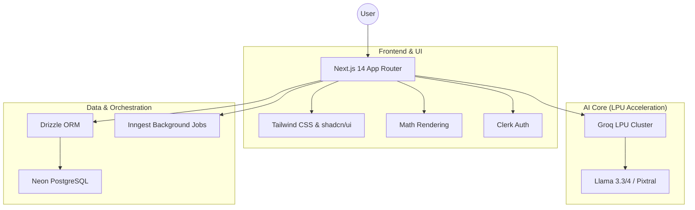

# 🚀 DoubtDesk: AI-Powered Collaborative Learning Classroom

**DoubtDesk** is a premium, AI-native academic platform designed to revolutionize the way students solve doubts and teachers manage learning. It blends ultra-fast AI reasoning with real-time classroom collaboration to provide a seamless pedagogical experience.

---

## ✨ Core Pillars

### 🧠 Neural Resolve™ AI Solver
*   **Multi-Modal Intelligence**: Solve doubts using natural language or by uploading a photo of your problem (OCR & Vision powered).
*   **Groq-Accelerated Reasoning**: Near-instant responses powered by Groq LPU™ Inference Engine using Llama-3.1/3.3/4 fallback clusters.
*   **Structured Pedagogy**: Get answers in three distinct layers:
    *   **Step-by-Step Logic**: Comprehensive derivation and methodology.
    *   **Simplified Mode**: Conceptual breakdown for better intuition.
    *   **Exam-Ready**: Concise, marks-oriented final answers.
*   **Interactive Context**: Click on any specific step to ask the AI for a deeper explanation of that exact logic.
*   **Full LaTeX Support**: Crystal-clear rendering of complex mathematical and scientific equations.

### 🏫 Virtual Academic Circles
*   **Classroom Management**: Teachers can "spawn" classrooms and invite students through secure unique invite codes.
*   **Collaborative Doubt Boards**: 
    *   **AI Resolve**: Instant AI-powered community solving.
    *   **Teacher Lane**: Direct access to subject matter experts.
    *   **Community Wisdom**: Peer-to-peer collaborative learning.
*   **Role-Based Experience**: Dedicated dashboards for Teachers (Moderation & Analytics) and Students (Learning & Progress).

### 📊 Pedagogical Analytics (Live Pulse)
*   **Concept Heatmaps**: Visualize "Topic Blockers" based on doubt volume to identify curriculum gaps.
*   **Resolution Pulse**: Track the ratio of solved vs. pending doubts in real-time.
*   **AI Personal Mentor**: Personalized weak-topic detection and strategy suggestions for every student.
*   **Activity Timeline**: Heatmaps for peak doubt hours to optimize teacher availability.

### 🛡️ Academic Safety Engine
*   **AI Moderation**: Integrated safety layer that filters non-academic content.
*   **3-Strike Policy**: Automated warnings and temporary blocks for persistent violation of academic focus.
*   **Audit Logs**: Complete transparency for teachers and admins.

---

## 🏗️ Technical Architecture



---

## 🛠️ Tech Stack

| Layer | Technology |
| :--- | :--- |
| **Framework** | [Next.js 14](https://nextjs.org/) (App Router) |
| **Language** | TypeScript |
| **Authentication** | [Clerk](https://clerk.com/) |
| **AI Inference** | [Groq SDK](https://groq.com/) (LPU™ Inference) |
| **Database** | [Neon PostgreSQL](https://neon.tech/) |
| **ORM** | [Drizzle ORM](https://orm.drizzle.team/) |
| **Background Jobs** | [Inngest](https://www.inngest.com/) |
| **Styling** | Tailwind CSS + shadcn/ui |
| **Math/OCR** | KaTeX + Tesseract.js / Vision LLMs |

---

## 🚀 Getting Started

### Prerequisites
- Node.js 18+
- Git
- API keys for: Clerk, Neon, Groq, and Inngest.

### Installation

1. **Clone the repository**
   ```bash
   git clone https://github.com/divysaxena24/DoubtDesk.git
   cd DoubtDesk
   ```

2. **Install dependencies**
   ```bash
   npm install
   ```

3. **Configure Environment Variables**
   Create a `.env` file:
   ```env
   # Database
   DATABASE_URL=your_neon_postgresql_uri

   # Auth
   NEXT_PUBLIC_CLERK_PUBLISHABLE_KEY=your_clerk_pub_key
   CLERK_SECRET_KEY=your_clerk_secret

   # AI
   GROQ_API_KEY=your_groq_api_key

   # Inngest
   INNGEST_EVENT_KEY=your_inngest_key
   ```

4. **Run Development Server**
   ```bash
   npm run dev
   ```

---

## 🤝 Contributing

We welcome contributions that improve the AI's pedagogical accuracy or enhance the collaborative classroom features.

1. Fork the Project.
2. Create your Feature Branch (`git checkout -b feature/NewFeature`).
3. Commit your Changes (`git commit -m 'Add NewFeature'`).
4. Push to the Branch (`git push origin feature/NewFeature`).
5. Open a Pull Request.

---

## 📄 License
Licensed under the MIT License.
